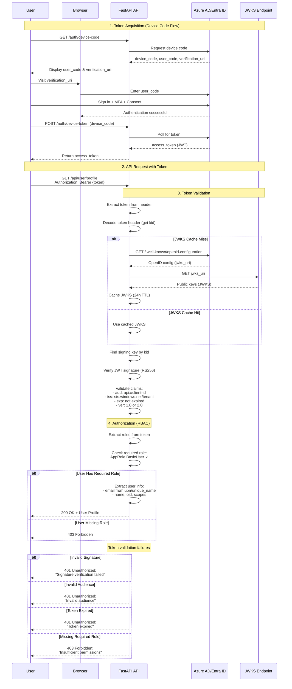

# Entra ID JWT Authentication - FastAPI

A production-ready FastAPI application with Microsoft Entra ID (formerly Azure AD) JWT token authentication. This project demonstrates best practices including singleton patterns, async/await, and comprehensive token validation.

## Features

- ✅ **JWT Token Validation** - Complete validation of Entra ID access tokens (v1.0 and v2.0)
- ✅ **JWKS Caching** - Efficient caching of JSON Web Key Sets with configurable TTL
- ✅ **Singleton Pattern** - Proper singleton implementation for validators and configuration
- ✅ **Async/Await** - Full async support for high performance
- ✅ **Type Safety** - Pydantic models for configuration and data validation
- ✅ **Production Ready** - Proper logging, error handling, and CORS support
- ✅ **Role-Based Access Control (RBAC)** - Support for Azure AD app roles
- ✅ **Scope Validation** - Validate required OAuth 2.0 scopes
- ✅ **Multiple Endpoints** - Sample protected API endpoints demonstrating usage
- ✅ **Device Code Flow** - Built-in token acquisition for testing and development

## Authentication & Authorization Flow



### Flow Breakdown

1. **Token Acquisition (Device Code Flow)**
   - User requests device code from API
   - User completes authentication in browser (with MFA)
   - API polls Azure AD and receives JWT access token
   - Token contains: scopes (`scp`), roles (`roles`), user info

2. **API Request with Token**
   - User sends request with `Authorization: Bearer {token}` header
   - FastAPI security extracts token

3. **Token Validation**
   - Decode token header to get `kid` (key ID)
   - Fetch JWKS from Azure AD (cached for 24h)
   - Verify JWT signature using RS256 algorithm
   - Validate claims: audience, issuer, expiration, version

4. **Authorization (RBAC)**
   - Extract roles from token's `roles` claim
   - Check if user has required role (e.g., `AppRole.BasicUser`)
   - Extract user information from token claims
   - Return user profile or 403 Forbidden

## Project Structure

```
EntraID Authentication & Authorization/
├── src/
│   ├── __init__.py
│   ├── main.py                    # FastAPI application
│   ├── auth/
│   │   ├── __init__.py
│   │   ├── jwt_validator.py       # JWT validation service (singleton)
│   │   └── dependencies.py        # FastAPI auth dependencies
│   ├── config/
│   │   ├── __init__.py
│   │   └── settings.py            # Configuration management (singleton)
│   └── models/
│       ├── __init__.py
│       └── user.py                # User models
├── pyproject.toml                 # Project dependencies
├── env.example                    # Environment variables template
└── README.md                      # This file
```

## Prerequisites

- Python 3.11 or higher
- Azure AD tenant with an app registration
- Access token from Entra ID

## Setup Instructions

### 1. Azure AD App Registration

Complete these steps in Azure Portal to configure your application:

#### Step 1.1: Create App Registration

1. Go to [Azure Portal](https://portal.azure.com) → **Azure Active Directory** → **App registrations**
2. Click **"New registration"**
3. Configure your application:
   - **Name**: Your API name (e.g., "My API")
   - **Supported account types**: Choose based on your needs
     - Single tenant (most common for enterprise apps)
     - Multi-tenant (if your API serves multiple organizations)
   - **Redirect URI**: Leave blank (not needed for API-only apps)
4. Click **"Register"**
5. After creation, note down:
   - **Application (client) ID** - You'll need this for `CLIENT_ID`
   - **Directory (tenant) ID** - You'll need this for `TENANT_ID`

#### Step 1.2: Enable Public Client Flow (Required for Device Code Flow)

⚠️ **CRITICAL**: This step is required for the device code authentication to work!

1. In your app registration, click **"Authentication"** in the left menu
2. Scroll down to **"Advanced settings"**
3. Under **"Allow public client flows"**, find the toggle:
   - **"Enable the following mobile and desktop flows"**
4. Set it to **"Yes"**
5. Click **"Save"** at the top

**Why?** Device code flow is designed for public clients (CLIs, testing tools) that cannot securely store client secrets. Without this setting, you'll get a `401 Unauthorized` error.

#### Step 1.3: Configure API Permissions

1. Click **"API permissions"** in the left menu
2. You should see **Microsoft Graph → User.Read** (added by default)
3. If you need additional permissions:
   - Click **"+ Add a permission"**
   - Choose **Microsoft Graph** or your custom API
   - Select **Delegated permissions**
   - Search and select the required permissions
   - Click **"Add permissions"**
4. (Optional) Click **"Grant admin consent for [Your Tenant]"**
   - This pre-approves permissions for all users
   - Recommended for enterprise deployments

**Common permissions:**
- `User.Read` - Read user profile (included by default)
- `email`, `profile`, `openid` - Basic user info
- `offline_access` - Get refresh tokens

#### Step 1.4: Expose Your API (Required - For Custom API Scopes)

⚠️ **REQUIRED**: You must expose your API and create at least one scope for the authentication to work!

1. Click **"Expose an API"** in the left menu
2. Click **"+ Set"** next to "Application ID URI"
   - Default: `api://{your-client-id}` (recommended)
   - Example: `api://4546d1ba-b797-41c6-af59-c7e198b59882`
   - Or use custom URI: `https://yourdomain.com/api`
3. Click **"Save"**
4. Click **"+ Add a scope"** to create your first scope:
   - **Scope name**: `api.scope` (you can use any name like `access_as_user`, `api.read`, etc.)
   - **Who can consent**: **Admins and users** (or Admins only for sensitive operations)
   - **Admin consent display name**: Access API as user
   - **Admin consent description**: Allows the app to access the API on behalf of the signed-in user
   - **User consent display name**: Access API as you
   - **User consent description**: Allows the app to access the API on your behalf
   - **State**: **Enabled**
5. Click **"Add scope"**
6. **Repeat step 4** to add more scopes if needed (e.g., `demo_oauth`, `api.write`, `api.admin`)

**Your final scopes will look like:**
- `api://4546d1ba-b797-41c6-af59-c7e198b59882/api.scope`
- `api://4546d1ba-b797-41c6-af59-c7e198b59882/demo_oauth`

**Note:** You only need to use the scope names (e.g., `api.scope`, `demo_oauth`) in your `.env` file - the application will automatically construct the full URIs!

#### Step 1.5: Configure App Roles (Optional - For Role-Based Access Control)

If you want to implement role-based access control (RBAC), you can define custom app roles:

1. Click **"App roles"** in the left menu
2. Click **"+ Create app role"** to add your first role:
   - **Display name**: Basic User
   - **Allowed member types**: **Users/Groups** (or Applications for service principals)
   - **Value**: `AppRole.BasicUser` (this is what appears in the token's `roles` claim)
   - **Description**: Basic user with read access
   - **Do you want to enable this app role?**: ✅ Checked
3. Click **"Apply"**
4. **Repeat step 2** to add more roles:
   - **Display name**: Admin User
   - **Value**: `AppRole.AdminUser`
   - **Description**: Administrator with full access
5. Click **"Apply"**

**Common role patterns:**
- `AppRole.BasicUser` - Basic access to the API
- `AppRole.AdminUser` - Administrative access
- `AppRole.ReadOnly` - Read-only access
- `AppRole.PowerUser` - Advanced features access

#### Step 1.6: Assign Roles to Users

After creating app roles, you need to assign them to users:

1. Go to **Azure Portal** → **Enterprise Applications** (not App Registrations!)
2. Find and click on your application
3. Click **"Users and groups"** in the left menu
4. Click **"+ Add user/group"**
5. Under **"Users"**, click **"None Selected"**
   - Search for and select the user
   - Click **"Select"**
6. Under **"Select a role"**, click **"None Selected"**
   - Choose a role (e.g., `AppRole.BasicUser`)
   - Click **"Select"**
7. Click **"Assign"**

**To assign multiple roles to the same user:**
- Repeat steps 4-7, selecting the **same user** but a **different role** each time
- The user will appear multiple times in the list, once for each role
- Their token will contain all assigned roles in the `roles` claim:
  ```json
  "roles": ["AppRole.BasicUser", "AppRole.AdminUser"]
  ```

**Alternative: Use PowerShell for bulk assignments:**
```powershell
Connect-AzureAD

$userId = "user-object-id"
$servicePrincipalId = "enterprise-app-object-id"

# Get all app roles
$appRoles = Get-AzureADServicePrincipal -ObjectId $servicePrincipalId | Select-Object -ExpandProperty AppRoles

# Assign BasicUser role
$basicRole = $appRoles | Where-Object { $_.Value -eq "AppRole.BasicUser" }
New-AzureADUserAppRoleAssignment -ObjectId $userId -PrincipalId $userId -ResourceId $servicePrincipalId -Id $basicRole.Id

# Assign AdminUser role to the same user
$adminRole = $appRoles | Where-Object { $_.Value -eq "AppRole.AdminUser" }
New-AzureADUserAppRoleAssignment -ObjectId $userId -PrincipalId $userId -ResourceId $servicePrincipalId -Id $adminRole.Id
```

#### Step 1.7: Add Platform Configuration (Optional)

For better security and tracking:

1. Still in **"Authentication"**, click **"+ Add a platform"**
2. Select **"Mobile and desktop applications"**
3. Check the redirect URI:
   - `https://login.microsoftonline.com/common/oauth2/nativeclient`
4. Click **"Configure"**

### Summary of Required Azure Settings

| Setting | Location | Value | Required? |
|---------|----------|-------|-----------|
| **Public client flows** | Authentication → Advanced settings | **Yes** | ✅ Required |
| **API Permissions** | API permissions | `User.Read` | ✅ Required |
| **Application ID URI** | Expose an API | `api://{client-id}` | ✅ Required |
| **API Scopes** | Expose an API → Scopes | `api.scope`, `demo_oauth`, etc. | ✅ Required (at least 1) |
| **App Roles** | App roles | `AppRole.BasicUser`, `AppRole.AdminUser` | Optional (for RBAC) |
| **Role Assignments** | Enterprise Applications → Users and groups | Assign roles to users | Optional (for RBAC) |
| **Platform config** | Authentication → Platforms | Mobile and desktop | Optional |

### 2. Install Dependencies

```bash
# Install using pip
pip install -e .

# Or install with dev dependencies
pip install -e ".[dev]"
```

### 3. Configure Environment Variables

Copy the example environment file and update with your values:

```bash
# Copy the example file
cp env.example .env

# Edit .env with your values
```

Required variables:
```env
TENANT_ID=your-tenant-id-here      # From Azure Portal
CLIENT_ID=your-client-id-here      # From Azure Portal
API_SCOPES=api.scope demo_oauth    # Your API scope names (space-separated)
```

**Important:** `API_SCOPES` uses just the scope names (not full URIs). The application automatically constructs full URIs like `api://client-id/api.scope`.

Examples:
- Single scope: `API_SCOPES=api.scope`
- Multiple scopes: `API_SCOPES=api.scope demo_oauth`
- Custom scope: `API_SCOPES=api.read api.write`

Optional variables:
```env
AUDIENCE=api://your-client-id      # Expected audience in token
TOKEN_VERSION=v2.0                 # v1.0 or v2.0
DEBUG=False                        # Enable debug mode
PORT=8000                          # Server port
```

### 4. Run the Application

```bash
# Run using Python
python -m src.main

# Or run using uvicorn directly
uvicorn src.main:app --reload

# Or run with custom host/port
uvicorn src.main:app --host 0.0.0.0 --port 8000
```

The API will be available at:
- Application: http://localhost:8000
- API Documentation: http://localhost:8000/docs
- ReDoc Documentation: http://localhost:8000/redoc

## Usage

### Getting an Access Token

To test the API, you need an access token from Entra ID. The application provides built-in endpoints using **Device Code Flow** - the industry-standard method for CLIs and testing.

#### ⭐ Device Code Flow (Built-in)

The **easiest and recommended way** to get a token:

```bash
# 1. Get device code
curl http://localhost:8000/auth/device-code

# 2. Visit https://microsoft.com/devicelogin in your browser
#    Enter the user_code displayed

# 3. Get your token (use device_code from step 1)
curl -X POST http://localhost:8000/auth/device-token \
  -H "Content-Type: application/json" \
  -d '{"device_code": "YOUR_DEVICE_CODE"}'
```

#### Alternative: Using Azure CLI
```bash
az login
az account get-access-token --resource api://your-client-id
```

#### Alternative: Using Postman
1. Create a new request
2. Go to Authorization tab
3. Type: OAuth 2.0
4. Configure with your Azure AD details
5. Get New Access Token

**Note:** For production web applications, authentication should be handled by your frontend (React/Angular) using Authorization Code + PKCE flow. Your FastAPI backend only validates tokens.

### Making API Requests

#### Public Endpoints (No Authentication)

```bash
# Health check
curl http://localhost:8000/health

# Root endpoint
curl http://localhost:8000/
```

#### Protected Endpoints (Requires JWT)

```bash
# Replace YOUR_TOKEN with your actual access token

# Get protected resource
curl -H "Authorization: Bearer YOUR_TOKEN" \
     http://localhost:8000/api/protected

# Get user profile
curl -H "Authorization: Bearer YOUR_TOKEN" \
     http://localhost:8000/api/user/profile

# Get user permissions
curl -H "Authorization: Bearer YOUR_TOKEN" \
     http://localhost:8000/api/user/permissions

# Get sample data
curl -H "Authorization: Bearer YOUR_TOKEN" \
     http://localhost:8000/api/data/sample
```

### Example Response

```json
{
  "message": "Access granted to protected resource",
  "user": {
    "subject": "00000000-0000-0000-0000-000000000000",
    "name": "John Doe",
    "email": "john.doe@company.com",
    "tenant_id": "your-tenant-id",
    "scopes": ["api.read", "api.write"],
    "roles": []
  }
}
```

## Architecture

### Singleton Pattern

The application uses singleton pattern for:

1. **Settings** (`get_settings()`) - Single configuration instance using `@lru_cache()`
2. **JWTValidator** - Single validator instance managing JWKS cache

### Authentication Flow

1. Client sends request with `Authorization: Bearer <token>` header
2. FastAPI security extracts the token
3. `get_token_payload()` dependency validates the token:
   - Fetches JWKS from Entra ID (with caching)
   - Verifies token signature using public key
   - Validates issuer, audience, expiration
   - Validates custom claims (tenant, version, scopes)
4. `get_current_user()` extracts user information from validated payload
5. Endpoint receives authenticated user object

### JWT Validation

The validator performs comprehensive checks:
- ✅ Signature verification using RS256 algorithm
- ✅ Issuer validation (matches expected Entra ID issuer)
- ✅ Audience validation (matches configured client ID)
- ✅ Expiration time (exp claim)
- ✅ Not before time (nbf claim)
- ✅ Token version validation
- ✅ Tenant ID validation
- ✅ Required scopes validation (if configured)

## API Endpoints

### Public Endpoints

| Endpoint | Method | Description |
|----------|--------|-------------|
| `/` | GET | Root endpoint with API information |
| `/health` | GET | Health check endpoint |
| `/docs` | GET | Interactive API documentation (Swagger) |
| `/redoc` | GET | Alternative API documentation (ReDoc) |

### Protected Endpoints (Require Authentication)

| Endpoint | Method | Description |
|----------|--------|-------------|
| `/api/protected` | GET | Basic protected endpoint demonstrating auth |
| `/api/user/profile` | GET | Get authenticated user's profile |
| `/api/user/permissions` | GET | Get user's scopes and roles |
| `/api/data/sample` | GET | Sample data endpoint |

## Advanced Usage

### Understanding Scopes vs Roles

**OAuth 2.0 Scopes:**
- Define **what the application can do** on behalf of the user
- Configured in "Expose an API" → Scopes
- Appear in token's `scp` claim (space-separated string)
- Example: `"scp": "api.scope demo_oauth"`
- **Used for:** Ensuring token was requested for your API (validated during device code flow)

**Azure AD App Roles:**
- Define **who the user is** and what they can access
- Configured in "App roles" → Create app role
- Appear in token's `roles` claim (array of strings)
- Example: `"roles": ["AppRole.BasicUser", "AppRole.AdminUser"]`
- **Used for:** Authorization - controlling access to specific endpoints

**This application's approach:**
- **Scopes** are validated automatically (users must have valid API scopes to get a token)
- **Roles** are used for endpoint authorization (`require_role()`, `require_any_role()`)
- Clean and simple - roles provide all the access control you need

### Using Role-Based Access Control (RBAC)

The application supports Azure AD app roles for fine-grained access control:

```python
from fastapi import Depends
from src.auth import require_role, require_any_role, get_current_user

# Require specific role
@app.get("/api/admin")
async def admin_endpoint(
    current_user = Depends(get_current_user),
    _: None = Depends(require_role("AppRole.AdminUser"))
):
    return {"message": "Admin access granted"}

# Require any of multiple roles
@app.get("/api/data")
async def data_endpoint(
    _: None = Depends(require_any_role("AppRole.BasicUser", "AppRole.AdminUser"))
):
    return {"data": "protected data"}
```

**How it works:**
1. Users are assigned app roles in Azure Portal (Enterprise Applications → Users and groups)
2. Token's `roles` claim contains assigned roles: `["AppRole.BasicUser", "AppRole.AdminUser"]`
3. FastAPI dependencies validate roles before allowing access

### Checking User Permissions in Code

```python
from src.models import User

@app.get("/api/resource")
async def resource_endpoint(current_user: User = Depends(get_current_user)):
    # Check if user has specific role
    if current_user.has_role("AppRole.AdminUser"):
        return {"message": "Admin access", "admin": True}
    
    # Check if user has specific scope
    if current_user.has_scope("api.scope"):
        return {"message": "Has API scope", "can_access": True}
    
    # Use convenience properties
    if current_user.is_admin:
        return {"message": "Admin user detected"}
    
    return {"message": "Basic access"}
```

## Development

### Code Quality

```bash
# Format code
black src/

# Lint code
ruff check src/
```

### Testing

```bash
# Run tests (when implemented)
pytest

# Run tests with coverage
pytest --cov=src tests/
```

## Security Considerations

1. **Never log tokens** - Tokens are sensitive credentials
2. **Use HTTPS in production** - Always use TLS/SSL
3. **Validate all claims** - Don't skip validation steps
4. **Keep dependencies updated** - Regularly update security packages
5. **Use proper CORS settings** - Configure appropriate origins
6. **Monitor token expiration** - Handle token refresh properly
7. **Implement rate limiting** - Protect against abuse (not included in this example)

## Troubleshooting

### Common Token Validation Issues

#### "Unable to fetch OpenID configuration"

- Check your `TENANT_ID` is correct
- Ensure network connectivity to login.microsoftonline.com
- Verify firewall/proxy settings

#### "Token validation failed: Invalid audience"

- Ensure `CLIENT_ID` matches the token's `aud` claim
- If using custom audience, set `AUDIENCE` environment variable to match the token's `aud` claim
- **Common fix:** Your token might have `"aud": "api://client-id"` but your `.env` has just the client ID
  - Solution: Set `AUDIENCE=api://your-client-id` in `.env`
  - Or the code will automatically add `api://` prefix if not set

#### "Token validation failed: Invalid issuer"

- Verify `TENANT_ID` is correct
- **Check token version:** Look at the `"ver"` claim in your token
  - v1.0 tokens: `"iss": "https://sts.windows.net/{tenant-id}/"`
  - v2.0 tokens: `"iss": "https://login.microsoftonline.com/{tenant-id}/v2.0"`
- **Solution:** Set `TOKEN_VERSION=v1.0` or `TOKEN_VERSION=v2.0` in `.env` to match your token
- The application now automatically handles both v1.0 and v2.0 token formats

#### "Token version mismatch. Expected 1.0, got 1"

- This was a bug in the version validation logic (now fixed)
- Ensure you have the latest code that properly compares version strings
- Set `TOKEN_VERSION=v1.0` in `.env` for v1.0 tokens

#### "Unable to find an algorithm for key"

- This was a bug in the JWKS key construction (now fixed)
- The application now automatically adds `"alg": "RS256"` to JWK keys if missing
- Ensure you have the latest code with this fix

#### "Signature verification failed"

- Token might be expired (check `exp` claim)
- Token might be corrupted
- JWKS might be outdated (will auto-refresh after TTL)
- Ensure token was issued by the correct tenant

### Token Debugging Tips

1. **Decode your token** at [jwt.ms](https://jwt.ms) to see all claims
2. **Check these claims match your configuration:**
   - `aud` (audience) → Should match `AUDIENCE` or `api://CLIENT_ID`
   - `iss` (issuer) → Should match expected issuer based on `TOKEN_VERSION`
   - `ver` (version) → Should be "1.0" or "2.0", match with `TOKEN_VERSION`
   - `tid` (tenant ID) → Should match `TENANT_ID`
   - `scp` (scopes) → Should contain your API scopes
   - `roles` → Should contain assigned app roles (if using RBAC)
3. **Check expiration:** Ensure token hasn't expired (`exp` claim)
4. **Verify role assignments:** Go to Enterprise Applications → Users and groups to see assigned roles

## References

- [Microsoft Identity Platform Documentation](https://learn.microsoft.com/en-us/entra/identity-platform/)
- [Access Tokens](https://learn.microsoft.com/en-us/entra/identity-platform/access-tokens)
- [OpenID Connect](https://learn.microsoft.com/en-us/entra/identity-platform/v2-protocols-oidc)
- [Azure AD App Roles](https://learn.microsoft.com/en-us/entra/identity-platform/howto-add-app-roles-in-apps)
- [OAuth 2.0 Scopes](https://learn.microsoft.com/en-us/entra/identity-platform/scopes-oidc)
- [FastAPI Security](https://fastapi.tiangolo.com/tutorial/security/)

## Quick Reference

### Token Claims Reference

| Claim | Description | Example |
|-------|-------------|---------|
| `aud` | Audience - who the token is for | `"api://4546d1ba-b797-41c6-af59-c7e198b59882"` |
| `iss` | Issuer - who issued the token | `"https://sts.windows.net/{tenant-id}/"` (v1.0) |
| `tid` | Tenant ID | `"a29f1550-7848-4264-b780-2874985f7fb0"` |
| `oid` | Object ID of the user | `"0fe29e0f-8040-496a-9a5a-72932c15aae0"` |
| `sub` | Subject - unique user identifier | `"QLtj8k3bz3fIvWzmZPqZAS7W..."` |
| `scp` | Scopes - delegated permissions | `"api.scope demo_oauth"` (space-separated) |
| `roles` | App roles assigned to user | `["AppRole.BasicUser", "AppRole.AdminUser"]` |
| `ver` | Token version | `"1.0"` or `"2.0"` |
| `exp` | Expiration time (Unix timestamp) | `1761285561` |
| `nbf` | Not before time (Unix timestamp) | `1761281653` |
| `iat` | Issued at time (Unix timestamp) | `1761281653` |

### Environment Variables Reference

| Variable | Required | Default | Description |
|----------|----------|---------|-------------|
| `TENANT_ID` | ✅ Yes | - | Azure AD Tenant ID |
| `CLIENT_ID` | ✅ Yes | - | Application Client ID |
| `API_SCOPES` | ✅ Yes | - | Space-separated API scopes |
| `AUDIENCE` | No | `api://{CLIENT_ID}` | Expected audience in token |
| `TOKEN_VERSION` | No | `v2.0` | Token version: `v1.0` or `v2.0` |
| `DEBUG` | No | `False` | Enable debug logging |
| `PORT` | No | `8000` | Server port |
| `JWKS_CACHE_TTL` | No | `86400` | JWKS cache TTL in seconds |

### Common Patterns

**Token Version Detection:**
- v1.0 tokens: `"iss": "https://sts.windows.net/{tenant}/"`, `"ver": "1.0"`
- v2.0 tokens: `"iss": "https://login.microsoftonline.com/{tenant}/v2.0"`, `"ver": "2.0"`

**Audience Format:**
- With api:// prefix: `"aud": "api://4546d1ba-b797-41c6-af59-c7e198b59882"`
- Without prefix: `"aud": "4546d1ba-b797-41c6-af59-c7e198b59882"`
- Set `AUDIENCE` to match your token's `aud` claim exactly

**Role Assignment:**
- Single role: User appears once in Enterprise App → Users and groups
- Multiple roles: User appears multiple times, once per role
- Token contains all roles: `"roles": ["AppRole.BasicUser", "AppRole.AdminUser"]`

